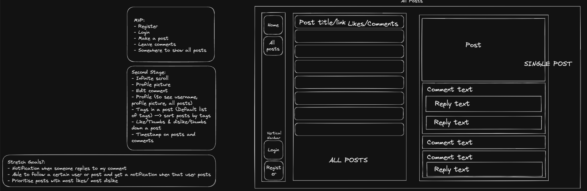
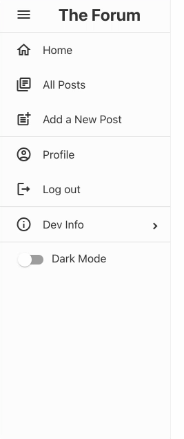
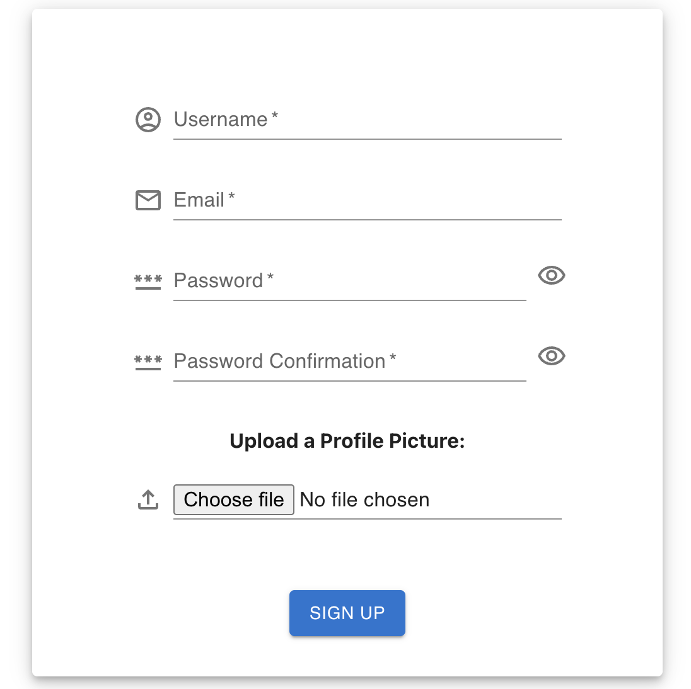
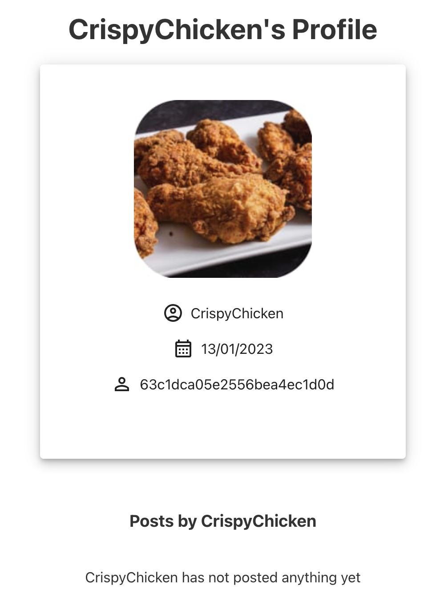
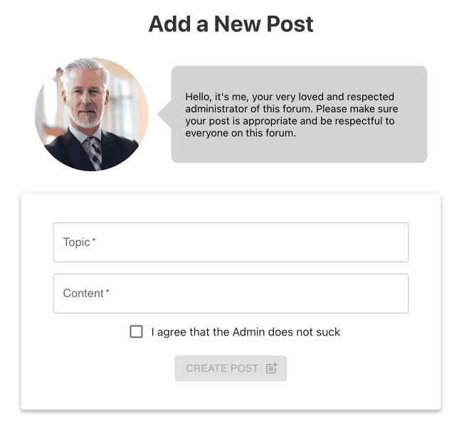
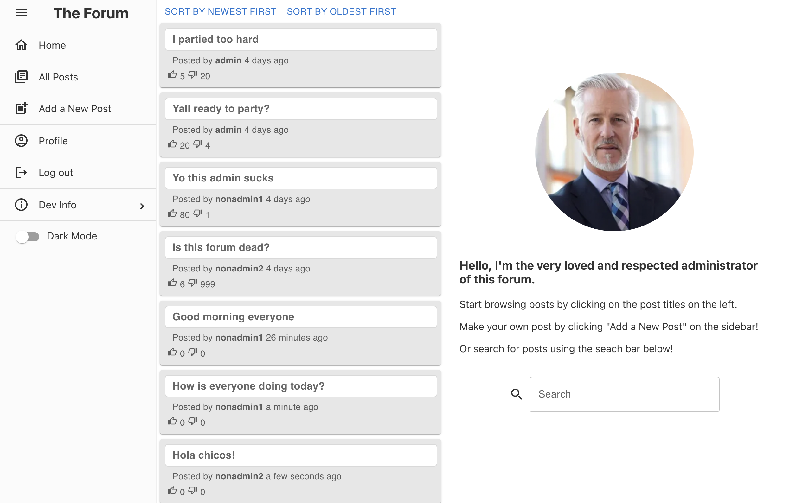
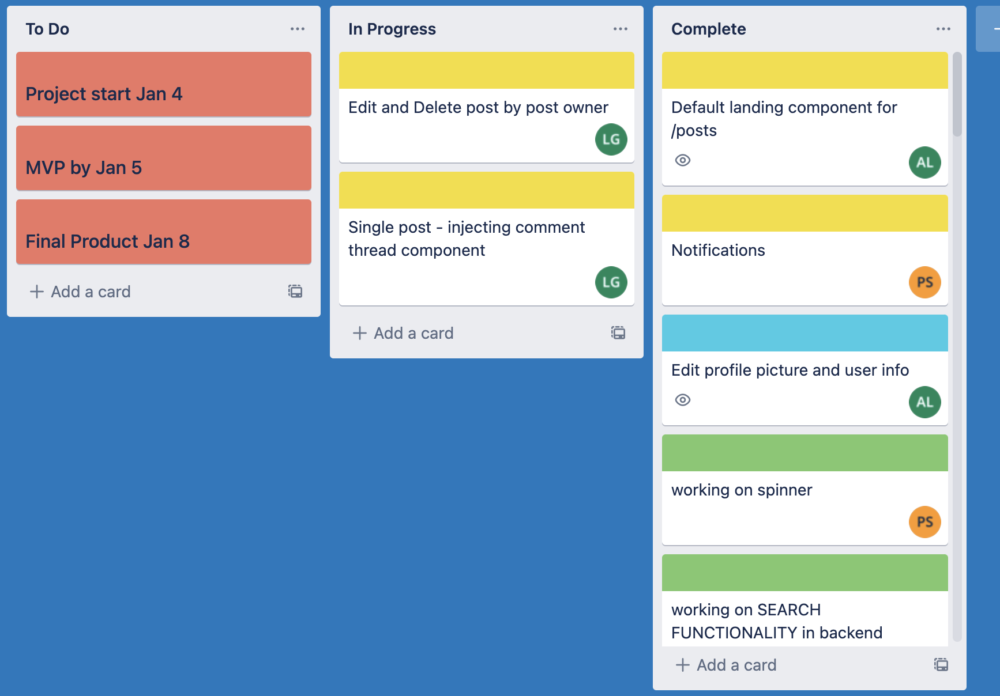

# ga-project-03-api

## Project Description

A fullstack MERN app named The Forum that features a discussion board which allows registered users to create posts, search posts, like/ dislike posts and create comments. My focus on this project was implementing the sidebar, the user functionalities in both backend and frontend, e.g. register/ login, edit profile, change password, the design of the app, and general project management. We successfully implemented the Agile workflow in this project with the help of Trello which made the development process seamless.

## Deployment Link

TBC

## Working Team & Timeframe

Working team:

- Alice Lo (https://github.com/siuusunn)
- Louis Grant (https://github.com/ljsgrant/)
- Parul Singh (https://github.com/ParulSingh16/)

Timeframe:

04/01/2023 - Project start

05/01/2023 - MVP done

08/01/2023 - Project finish

## Technologies Used

Front End: React, Node, HTML, CSS, Sass, Mater

Back End: MongoDB, Express, Cloudinary

Development Tools: Visual Code Studio

## Brief

Build a full stack app using MongoDB, Express, React.js and Node.js. The functionalities and design are up to the student.

## Planning

The team and I wanted to do an app with some social aspects instead of a plain “login and display info” app. We decided to create a discussion-board type of app that utilizes the MERN stack.

We identified the MVP features, basic wireframe, advanced functionalities and stretch goals.



## Code Process

The development is divided into three phases: MVP, Second stage features, and stretch goals. We started building the back end first before moving on to the front end.

My responsibilities for this project are:
Back end: Creating basic project framework for the team to work on, User model, User controller, Registration & Login, Seed file
Front end: Sidebar, Register, Login, Profile page, Add New Post, Default Landing Page, Revamping the Home page and Search Bar, general design and styling of the front end interface
Other: Project management

These are all divided into respective cards on our project’s Trello board so we can track the progress and make sure no one is blocked, along with the help of daily stand-ups and constant communications on Zoom and Slack.

### User Model & Verifications

I built the user model and verifications using mongoose, mongoose-hidden, mongoose-unique-validator, bcrypt and regex. It provided users a secured way of registering and logging in.

```
userSchema.pre('save', function encryptPassword(next) {
 if (this.isModified('password')) {
   this.password = bcrypt.hashSync(this.password, bcrypt.genSaltSync());
 }
 next();
});


userSchema.methods.validatePassword = function validatePassword(password) {
 return bcrypt.compareSync(password, this.password);
};


userSchema.plugin(mongooseHidden({ defaultHidden: { password: true } }));


userSchema.plugin(mongooseUniqueValidator);
```

### User Controller

I created the functions to register, login, get all users’ info, get a single user’s info, and edit a single user to prepare for the features we planned for the front end client.

```
async function loginUser(req, res, next) {
 try {
   const user = await User.findOne({ email: req.body.email });


   if (!user) {
     return res.status(404).json({ message: 'User not found' });
   }


   const isValidPassword = user.validatePassword(req.body.password);


   if (!isValidPassword) {
     return res.status(403).json({ message: 'Invalid password' });
   }


   const token = jwt.sign(
     { userId: user._id, isAdmin: user.isAdmin },
     SECRET,
     { expiresIn: '12h' }
   );


   return res.status(202).send({
     token,
     message: `Welcome back, ${user.username}!`
   });
 } catch (e) {
   next(e);
 }
}


```

### Sidebar

I implemented a responsive Side Bar as Nav Bar using react-pro-sidebar package, and customized it using the package’s API and MUI. Some menu items are different depending on the current user’s login status. This functionality uses a custom hook I created named useAUtheticated:

```
import { useState, useEffect } from 'react';
import { useLocation } from 'react-router-dom';
import { AUTH } from '../lib/auth';


export const useAuthenticated = () => {
 const { pathname } = useLocation();
 const [isLoggedIn, setIsLoggedIn] = useState(false);


 useEffect(() => {
   setIsLoggedIn(AUTH.getPayload());
 }, [pathname]);


 return [isLoggedIn, setIsLoggedIn];
};

```

A toggle button for dark mode was also added in the latter stage of development as it was one of the stretch goals.



### Register & Login

I built the forms in register and login component with MUI. They offer standard register and login functions, and also allows users to upload a profile picture of their choices. I added the password visibility toggle button after seeing my teammate struggling with entering the correct passwords!



### Profile

I started with a very basic profile component that only shows profile picture, username, date of registration and user id. Then I made some slight changes in the User model and Post controller so that I can add a component that shows all the posts made by the user and respective buttons to go to the particular posts. And as one of the stretch goals, I added the Edit Profile & Password feature, the page shows the updated profile page instantly without having to manually reload.

User will not see the Edit Profile button if they are viewing another user’s profile page. I achieved this by using conditional rendering:


```
{isEditMode ? (
  <>
     <Box>
      <Button onClick={handleSaveChanges} variant='contained'sx={{ mr: 2 }}>
      Save Changes
      </Button>
      <Button onClick={toggleEditMode} variant='outlined'>
      Cancel
      </Button>
     </Box>
  </>
) : (
    <Button onClick={toggleEditMode} variant='outlined'>
    Edit Profile & Password
    </Button>
    )}
  </>
)}
```

Results:


### Add New Post

This component is where I experimented with the checkbox using useState, handleTick() and conditional rendering:



### Default Landing Page for Post Index

I noticed that the right hand side of the client shows a big blank space when users first navigate to the All Post page, hence I created a Default Landing Page component and added it to the PostIndex component. This is also where I relocated the Search Bar to and revamped it with MUI:



I also added the feature to show how long ago the post was added using `moment(post?.createdAt).fromNow()`

### Home

I revamped the Home component and added a simple slidable card that shows all the users on the platform. When the picture is clicked, it will take users to that particular user’s profile page.


### Dark Mode

On the last day of the project, I added the functionality to allow user to toggle dark mode. A toggle button was added to the Side Bar. I used the local storage to store the theme info so that the theme stays the same even after the page refreshes.

### Styling

After I finished the components that I am responsible for, and completed the stretch goals. I spent time on styling using CSS, Sass and MUI’s built-in styling to improve the UI and to make sure front end feels cohesive.

### Project Management

I created the cards and tracked the progress on Trello constantly to make sure we are on track and on time, and most importantly, to not block anyone. Very happy to say that we successfully implemented the Agile workflow on this project without any blockage.



## Challenges

### Rich Text Editor

One of the stretch goals for me is to implement a Rich Text Editor. After lots of trials and errors when experimenting with several RTE packages, I could not find a good solution to serialize the returned data, and sadly I reverted back to using a plain text editor.

### Working in a Bigger Team

Even though we are in the same team, every team member has their own style of writing codes. So initially it was a bit of a challenge to read everyone’s codes and understand how to work with them.

## Wins

### Agile Workflow

One of our main focuses was to avoid blockage during development and we implemented the agile workflow, and communicated constantly which made the development process very seamless!

### Features & Styling

Given the timeframe to work on this project, I am very proud of the functionalities the team and I created. It is a feature-rich app that has cohesive and clean design, and a tongue-in-cheek theme.

## Key Learnings/ Takeaways

- Using MERN - This project is a great practice to polish my skills
- How to work in a bigger team without blockage or merge conflicts
- Using and choosing npm packages
- The amazing capabilities of React!

## Bugs

- Users cannot like/ dislike a comment, it is showing undefined
- Search Bar results does not clear when the input field is cleared

## Future Improvements

- Improved layout of Sidebar
- Separate the Edit Profile, Change Password and Change Profile Picture - functionalities on Profile
- Notifications
- Sort posts by newest/ oldest
